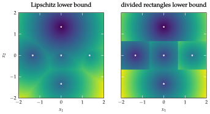
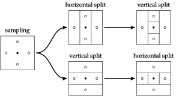

# DividedRectangles.jl

**DividedRectangles.jl** provides an implementation of the DIRECT (DIvided RECTangles) algorithm for global optimization. The DIRECT algorithm is particularly useful for optimizing functions where the Lipschitz constant is unknown. This package allows users to perform both univariate and multivariate optimization efficiently.

## Installation

To install the package, start Julia and run the following command:

```julia
Pkg.add("DividedRectangles")
```

## Usage

To use the `DividedRectangles` module, start your code with:

```julia
using DividedRectangles
```

### Example: Univariate Optimization

The following example demonstrates how to use the DIRECT algorithm to find the minimum of a univariate function:

```julia
using DividedRectangles

# Define the objective function
f(x) = sin(5 * x) + cos(2 * x)

# Set the search bounds
a = [-1.0]
b = [2.0]

# Optimize
result = DividedRectangles.optimize(f, a, b)

println("Optimal value found at: ", result)
```

### Example: Multivariate Optimization

The following example shows how to optimize a multivariate function using the DIRECT algorithm:

```julia
using DividedRectangles

# Define the objective function
f(x) = x[1]^2 + x[2]^2 + 3 * sin(5 * x[1]) + 2 * cos(3 * x[2])

# Set the search bounds
a = [-2.0, -2.0]
b = [2.0, 2.0]

# Optimize
result = DividedRectangles.optimize(f, a, b)

println("Optimal value found at: ", result)
```

### Parameters
- `f`: This is the objective function to minimize. Should be an operation that accepts a vector of Float64 values.
- `a`: A vector with the lower bounds to be used in the search space.
- `b`: An upper-bound vector for the search space.
- `max_iterations`:  Maximum number of iterations to run the optimization. The default is 100.
- `min_radius`: The minimum allowable size of a hyper-rectangle (default: '1e-5').

## Theory
The DIRECT algorithm does not require a known Lipschitz constant; therefore, it is quite robust for a wide range of optimization problems. It divides the search space into smaller hyper-rectangles, recursively, with a function evaluation at the center of every rectangle, and focuses further exploration in the most promising regions.

The power of this algorithm stems from the fact that it works against any problem whose objective function contains a number of local minima, since it escapes local minima by systematically covering the entire search space.

## Core Functions

### `optimize`
The `optimize` function is the primary function of the `DividedRectangles` module. It implements the DIRECT algorithm to find the minimum of a given objective function within specified bounds.

**Arguments:**
- `f`: The objective function to be minimized.
- `a`: Vector of lower bounds for the search space.
- `b`: Vector of upper bounds for the search space.
- `max_iterations`: (Optional) The maximum number of iterations (default: 100).
- `min_radius`: (Optional) The minimum radius of hyper-rectangles (default: 1e-5).

**Returns:** 
- A vector representing the coordinates of the optimal point found.

## Advanced Usage
### Fine-Tuning Optimization:
The `optimize` function offers several parameters for fine-tuning the optimization process:

- `max_iterations`: Sets the maximum number of iterations to perform. Increasing this value may improve the accuracy of the result but will require more computational time.
- `min_radius`: Specifies the minimum allowable size of the hyper-rectangles. This can be adjusted to control the granularity of the search.
Example with custom parameters:

```julia
result = DividedRectangles.optimize(f, a, b, max_iterations=500, min_radius=1e-6)
```
## Parallelization

For large-scale optimization problems, the package can leverage Julia's parallel computing capabilities. You can distribute the evaluation of function centers across multiple cores or nodes, significantly speeding up the optimization process.

```julia
using Distributed
addprocs(4)  # Add 4 worker processes

@everywhere using DividedRectangles

result = DividedRectangles.optimize(f, a, b)
```
## Visualization

To better understand the optimization process, here are visualizations that represent different stages and aspects of the DIRECT algorithm's progress:

1. 
2. 
3. 
4. 
5. 
6. 
7. 
8. 
9. 
10. 

Each image corresponds to a specific step or result in the optimization process, helping to visualize how the algorithm explores the search space and converges to a solution.

## Credits

Contributors to this package include Anshrin Srivastava, Mykel Kochenderfer, and Tim Wheeler.

---
