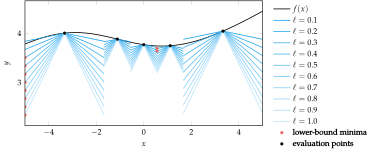
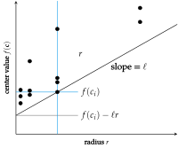

# Algorithms

The DIRECT (Divided Rectangles) algorithm incrementally refines a rectangular partition of the design space, using a heuristic inspired by potential Lipschitz constants to guide the refinement. This partitioning allows for global optimization by balancing exploration and exploitation of the design space. 

To simplify the mathematics and avoid oversensitivity to dimensions with larger domains, DIRECT first normalizes the search space to be the unit hypercube.

## Normalization:

DIRECT first normalizes the search space to be the unit hypercube. 

If we are minimizing $f(\mathbf{x})$ in the interval between lower and upper ranges $\mathbf{a}$ and $\mathbf{b}$ DIRECT will instead minimize:

$$
g(\mathbf{x}) = f(\mathbf{x} \odot (\mathbf{b} - \mathbf{a}) + \mathbf{a})
$$

After finding the minimum $f(\mathbf{x})$ of ($g$), the minimum of ($f$) is:

$$
\mathbf{x}^* \odot (\mathbf{b} - \mathbf{a}) + \mathbf{a}
$$

---

## Partitioning the Search Space:
DIRECT maintains a partition of this unit hypercube into hyperrectangular intervals. Each interval has:

- A center ($c^{(i)}$)
- An associated objective function value $f(\mathbf{c}^{(i)})$
- A radius ($r^{(i)}$), which is the distance from the center to a vertex.

DIRECT begins every iteration by identifying intervals to be split with additional function evaluations. It splits the intervals for which a Lipschitz constant ($\ell$) exists such that that interval contains the Lipschitz lowerbound.

---

## Splitting Intervals

DIRECT splits the identified intervals along their longest dimensions, dividing each interval into thirds. These splits refine the resolution in areas of interest, increasing accuracy near the minimum while avoiding excessive evaluations in less promising regions. The heuristic ensures that intervals are split in a way that balances the need for exploring the global space and refining local areas of interest.

---

## Lipschitz Lower Bound

The Lipschitz lower bound for an interval is a circular cone extending downwards from its center ($\mathbf{c}^{(i)}$):

$$
f(\mathbf{x}) \geq f(\mathbf{c}^{(i)}) - \ell \|\mathbf{x} - \mathbf{c}^{(i)}\|_2
$$

This lower bound helps guide the decision of which intervals to split. The intervals for which a Lipschitz constant ($\ell$) exists such that the interval contains the Lipschitz lower bound are selected for further subdivision.

---

## Visulizations:
To better understand the optimization process, here are some visualizations that represent different stages and aspects of the DIRECT algorithm's progress:

The Lipschitz lower bound for different Lipschitz constants. Not only does the estimated minimum change locally as the Lipschitz constant is varied, the region in which the minimum lies can vary as well.

---

The DIRECT lower bound for different Lipschitz constants `. The lower bound is not continuous. The minimum does not change locally but can change regionally as the Lipschitz constant changes

---

The left contour plot shows such a lower bound using five function evaluations. The right contour plot shows the approximation made by DIRECT, which divides the region into hyper-rectangles—one centered
about each design point. Making this assumption allows for the rapid calculation of the minimum of the lower bound.

---

The potentially optimal intervals for the DIRECT method form a piecewise boundary that encloses all intervals along the lower-right. Each dot corresponds to a hyper-rectangle.

---

Potentially-optimal hyper-rectangle identification for a particular Lipschitz constant. Black dots represent DIRECT hyper-rectangles and their location in (f(c),r) space. A black line of slope ` is drawn through the dot belonging to the best interval. The dots for all other hyper-rectangles
must lie on or above this line.

---

Interval splitting in multiple dimensions (using DIRECT) requires choosing an ordering for the split dimensions.

---

Consider the function $f(x) = sin(x) + sin(2x) + sin(4x) + sin(8x)$ on the interval [−2, 2] with a global minimizer near −0.272. Optimization is difficult because of multiple local minima. The figure above shows the progression of the univariate DIRECT method on this objective function, with intervals chosen for splitting rendered in blue.

---

**Important Note**: The content above is borrowed from Chapter 7, ***"Direct Methods,"*** of the forthcoming second edition of ***"Algorithms for Optimization"*** by Mykel Kochenderfer and Tim Wheeler.
